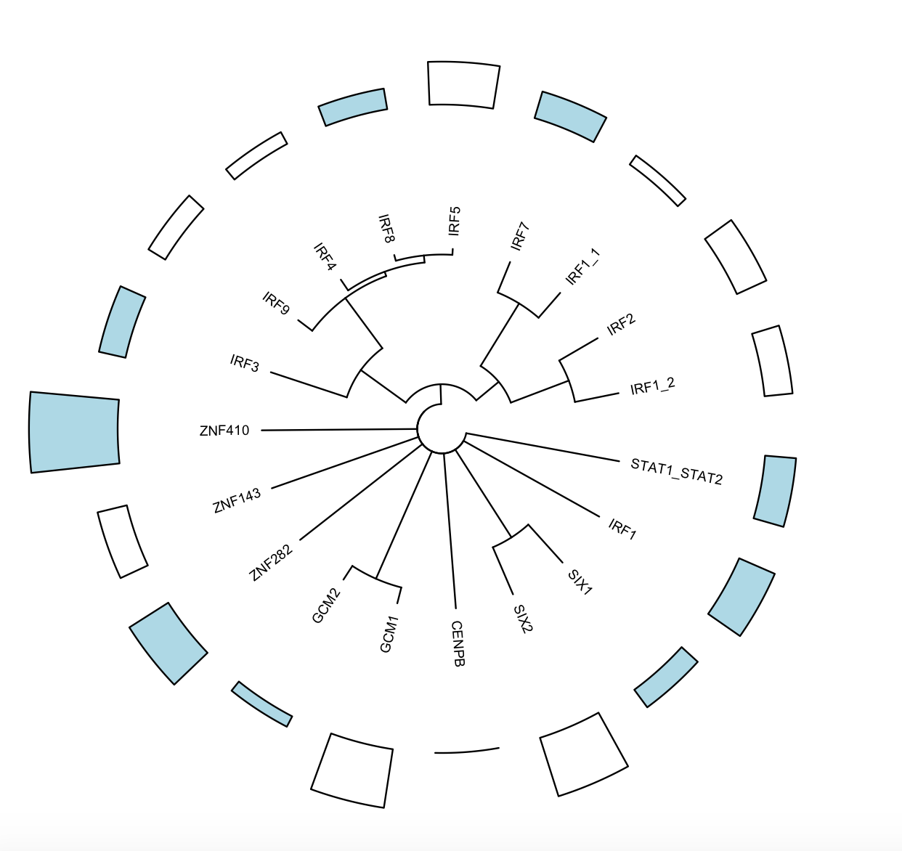
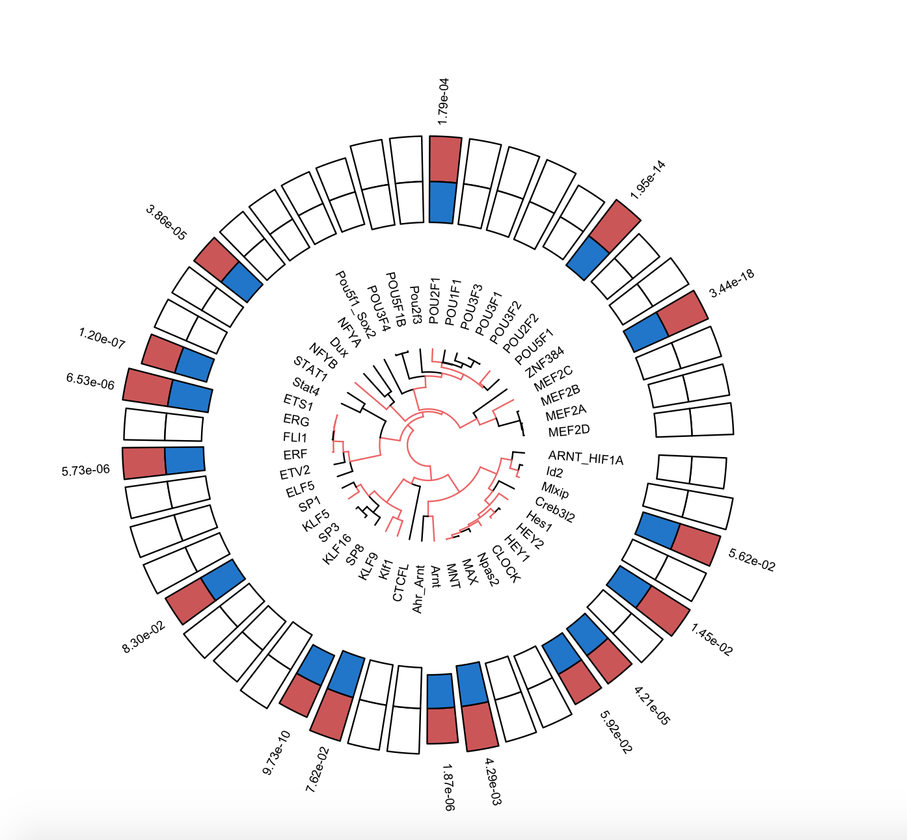

# 2018 Computational Biosciences Fellowship at UC Denver
Computational Biosciences Fellowship at Anschutz (UC Denver), mentored by Dr. Sonia Leach, work from 2018

Below is test output constructed from the Interferon Regulatory Factor (IRF) position weight matrices from the JASPAR database. The outermost track would display skew for percentage of target sequences that were relatively enriched compared to the percentage of background sequences, but here we used mock data as a test for the visualization.

This is using an actual dataset. The innermost track is the actual dendrogram, where the branches with an adjusted p value less than or equal to 0.1 is highlighted in red. For the outermost track, target sequence skew is colored red and the background sequence skew is colored blue. The outermost track contains the p values for the members of the tree that match the p value criteria we set (padj <= 0.1).

